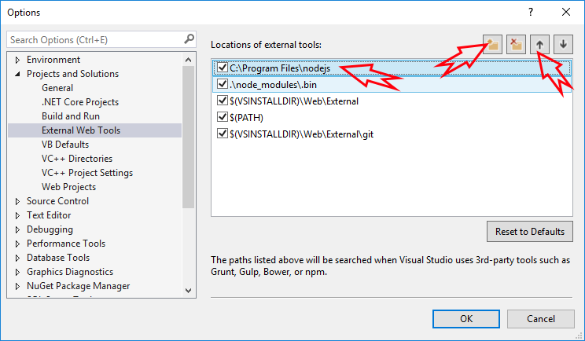
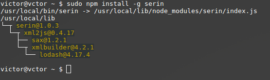
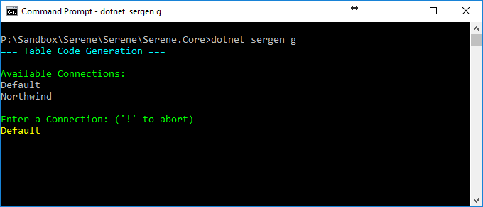

# Installation

## Visual Studio Version

The application requires _Visual Studio 2019_ 16.8.3+ and .NET CORE 5 SDK installed. 

Please make sure your version in _About Visual Studio_ dialog is something like 16.8.3+. 

## .NET Core SDK

Please install .NET Core SDK 5.0+ for your Visual Studio from:

[https://dotnet.microsoft.com/download](https://dotnet.microsoft.com/download)


### Visual Studio Version

The application requires _Visual Studio 2019+_ with most recent updates installed. .NET CORE 5 SDK is also only supported in Visual Studio 2019+. 

An alternative option is to use command line to create projects and use Visual Studio Code if you don't have access to Visual Studio 2019+.

Please install .NET Core 5 SDK from:

https://dotnet.microsoft.com/download

### Visual Studio TypeScript Extension

As of writing, the recommended version of TypeScript is 4.0+ 

The project comes with a reference to a recent version of Microsoft.TypeScript.MsBuild package and it is supposed to be used by Visual Studio 2019+ automatically.

You may also check https://www.typescriptlang.org/download for information on updating your TypeScript.

### NodeJS / NPM

NodeJS / NPM is used for the following:

- TypeScript typings (.d.ts) for libraries like jQuery, Bootstrap etc. 
- Less compilation (lessjs)
- Code generation through Sergen by parsing TypeScript sources

NodeJS and NPM LTS (Long Term Support) versions are required and you may download them from [https://nodejs.org/en/](https://nodejs.org/en/)

The application will check their versions on project creation and ask for confirmation to download and install them. Anyway, please check your versions manually by opening a command prompt:

```cmd
> npm -v
5.4.2
```

```cmd
> node -v
8.7.0
```

If you get an error, they might not be installed or not in path. Also confirm that the versions listed are higher than the ones shown above.

## Visual Studio and External Web Tool Paths

Even if you have correct Node / NPM installed, Visual Studio might still be trying to use its older version of NodeJS that is installed with VS itself.

Click _Tools_ => _Options_, and then under _Projects and Solutions_ => _External Web Tools_ add _C:\Program Files\nodejs_ to the top of the list by clicking plus folder icon, typing _C:\Program Files\nodejs_ and using _Up Arrow_ to move it to the start:



## Installing Serene

After you have installed prerequisites, please follow *Getting Started* section in *Serenity Guide*:

https://serenity.is/docs/getting_started/README

## Creating a Serene .NET Core Project using command line in Linux / OSX / Windows

This option is available in OSX / Linux / Windows with some help from our new NPM package *Serin*.

### Install Serin in Global Mode

Install our project initializer, *serin* as a global tool using NPM:

**Windows:**
```
> npm install -g serin
```

**Linux / OSX:**

```sh
> sudo npm install -g serin
```



> Thanks to Victor (@vctor) for Linux screenshots

### Create Folder for New Project

Create an empty *MySerene* (or a name you like) folder.

**Windows:**

```cmd
> cd c:\Projects
> mkdir MySerene
> cd MySerene
```

**Linux / OSX:**

```sh
> cd ~
> mkdir MySerene
> cd MySerene
```
.
> Serin has to be run from a completely empty directory

### Run Serin to Create a New Project

While inside an empty directory, run *serin*:

```cmd
> serin
```


Type an application name, e.g. *MySerene* and press enter. Take a break while Serin creates 
your project, initializates static content and restores packages etc.

After Serin creates your project, you will have a *MySerene.Web* folder under current directory. 
Enter that directory:

```cmd
> cd MyApp.Web
```

## Running Serene

If you are using Visual Studio, you can just rebuild and run your application 
(after setting connection strings).

For OSX / Linux, first restore packages:

```cmd
> dotnet restore
```

Make sure you run this command under *MySerene.AspNetCore* folder.

Then type:

```cmd
> dotnet run
```

Now open a browser and navigate to `http://localhost:5000`.

> Actual port may vary. You'll see it on console after executing *dotnet run*.

## Running Sergen


To use sergen, open a command prompt and CD into the project directory (one that contains *appsettings.json*) and type:

> dotnet sergen g



Sergen will list connections in *appsettings.json* file.

You can use *TAB completion*, e.g. type *D* and press *TAB* to complete *Default*.

After pressing *Enter* you'll get a list of tables in that database:


Again, they exact table name or use *TAB completion*.


Then, you can select a Module Name, Class Identifier, Permission Key and what to generate, or just accept defaults by pressing *ENTER*.

## Serene .NET Core Version and T4 Templates

Serene .NET Core version doesn't use T4 templates, but instead uses transformation through *dotnet-sergen*.

*ClientTypes.tt*, *MVC.tt* and *ServerTypings.tt* are integrated into *dotnet-sergen* itself.

Your project is configured to automatically transform *MVC*, *ClientTypes* before build, and *ServerTypings* after build.

Here is how it is configured in your *CSPROJ* file:

```xml
  <Target Name="PrecompileScript" BeforeTargets="BeforeBuild">
    <Exec Command="dotnet sergen mvc" ContinueOnError="true" />
    <Exec Command="dotnet sergen clienttypes" ContinueOnError="true" />
    <Exec Command="cmd /c &quot;$(NpmPath)npm&quot; install" />
  </Target>
  <Target Name="PostcompileScript" AfterTargets="Build">
    <Exec Command="node_modules/.bin/lessc ./wwwroot/Content/site/site.less ./wwwroot/content/site/site.css" ContinueOnError="true" />
    <Exec Command="node_modules/.bin/tsc -p ./tsconfig.json" ContinueOnError="true" />
    <Exec Command="dotnet sergen servertypings" ContinueOnError="true" />
  </Target>
  <ItemGroup>
    <DotNetCliToolReference Include="Serenity.CodeGenerator" Version="2.9.21" />
  </ItemGroup>
```

You might also run these commands manually in project directory:

> Make sure you build project successfully first

To transform *MVC*, e.g. view location helpers, make sure you are under project directory 
(the one that has *appsettings.json* file) and run:

```cmd
dotnet sergen mvc
```

> You might also use `dotnet sergen m`

To transform *ClientTypes*, e.g. editor, formatter and other types:

```cmd
dotnet sergen clienttypes
```

> You might also use `dotnet sergen c`

To transform *ServerTypings*, e.g. rows, enums, services etc:

> Make sure your project runs before executing transform, as sergen uses your output DLL.

```cmd
dotnet sergen servertypings
```

> You might also use `dotnet sergen s`

It is also possible to run them ALL at ONCE:

```
dotnet sergen transform
```

> You might also use `dotnet sergen t`

## Restoring Static content

.NET Core projects doesn't support installing content files, e.g. scripts, css, fonts, images 
delivered via NuGet packages into ASP.NET Core projects, so we wrote a workaround for you to use until we migrate all to NPM.

```cmd
dotnet sergen restore
```

> You might also use `dotnet sergen r`

This will enumerate referenced packages and restore static content from them into `wwwroot` folder.

> *Serin* runs this automatically at project initialization, but in case you'll update NuGet packages later, you'll need to run this command again to restore static content from new packages.

## Updating Serenity Packages in .NET Core Projects

You can update *Serenity.Net.Web*, "*Serenity.Assets*" and "*Serenity.Scripts*" packages as usual from package manager console. But after updating, please run 

```cmd
dotnet tool update sergen
dotnet sergen restore
```

so that static script files in *Serenity.Assets* and *Serenity.Scripts* can be copied and updated in your *wwwroot* directory.
