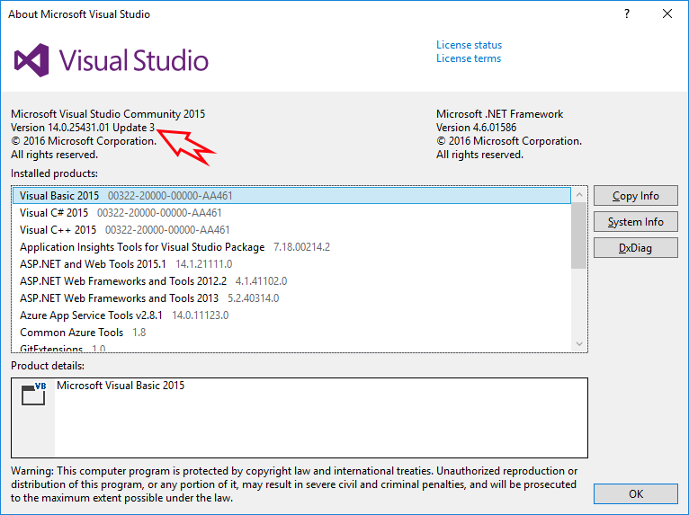
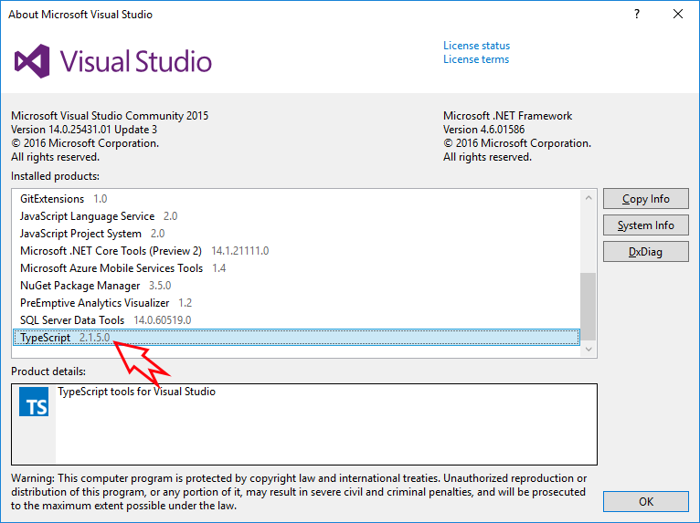
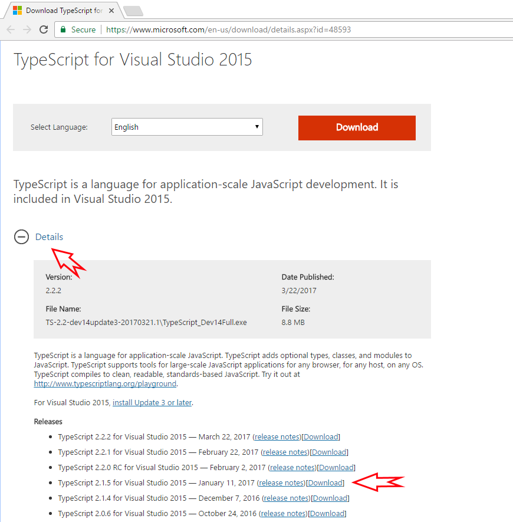
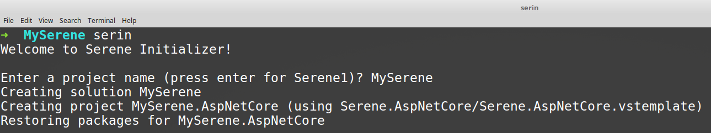
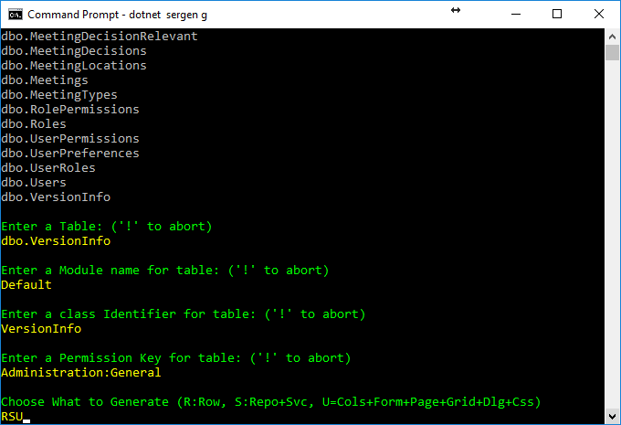

# Installation

## Visual Studio Version

Serene .NET framework version (ASP.NET MVC) requires _Visual Studio 2017_ or _Visual Studio 2015_ with **Update 3** installed. 

If you have Visual Studio 2015, please make sure that you have **Update 3** installed by looking at Help => About



> It might be possible to work with Visual Studio 2013 as well but you'll have many intellisense errors as TypeScript 2.1.5 can't be installed in VS2013.

Serene .NET Core (ASP.NET Core MVC) version only works in Visual Studio 2017. 

Microsoft recently obsoleted *project.json* based projects and replaced them with a lighter version of *MsBuild* based *CSPROJ* projects. This new project system only works in Visual Studio 2017, so if you want to work with .NET Core version of Serene, either you need to use Visual Studio 2017 or go lighter with Visual Studio Code / Command Line.

## Visual Studio TypeScript Extension

Currently, the recommended version of TypeScript is 2.1.5. 

Even though Serene uses NodeJS based TypeScript compiler (tsc) on build, Visual Studio still uses its own version of TypeScript for intellisense and refactoring etc. If you have an older version of that extension, you'll be greeted with many errors as soon as you open a Serene project.

To check what version of TypeScript Visual Studio Extension you have, again see Help => About:



Visual Studio 2017 comes with TypeScript 2.1.5 by default, but Visual Studio 2015 might include older versions.

If you have something lower than 2.1.5 there, you need to install TypeScript for Visual Studio 2015 extension.

> TypeScript version you see in Control Panel / Add Remove Programs doesn't matter at all. What matters is the one  that is enabled in Visual Studio.

TypeScript versions after 1.8.6 requires Visual Studio 2015 Update 3 to be installed first, so even if you try to install the extension it will raise an error, so please first install Update 3.

You can get TypeScript extension for your Visual Studio version from http://www.typescriptlang.org/#download-links.

Here is the link for Visual Studio 2015:

[https://www.microsoft.com/en-us/download/details.aspx?id=48593](https://www.microsoft.com/en-us/download/details.aspx?id=48593)

But **don't click the download button** right away. Expand **Details** section, and select the exact version you need (e.g. 2.1.5):



Later versions, e.g. 2.2.2 might also work but keeping in sync with the version we currently use, can help you avoid compability problems that might come with them.

## NodeJS / NPM

Serene uses NodeJS / NPM for these:

- TypeScript typings (.d.ts) for libraries like jQuery, Bootstrap etc. 
- TypeScript compiler itself (tsc)
- Less compilation (lessjs)
- T4 Code generation by parsing TypeScript sources

It requires NodeJS v6.9+ and NPM 3.10+

Serene will check their versions on project creation and ask for confirmation to download and install them. Anyway, please check your versions manually by opening a command prompt:

```cmd
> npm -v
3.10.10
```

```cmd
> node -v
6.9.4
```

If you get an error, they might not be installed or not in path. Please install LTS (long term support) versions from [https://nodejs.org/en/](https://nodejs.org/en/)

> Current version might also work but is not tested.

## Visual Studio and External Web Tool Paths

Even if you have correct Node / NPM installed, Visual Studio might still be trying to use its own integrated, and older version of NodeJS.

Click _Tools_ => _Options_, and then under _Projects and Solutions_ => _External Web Tools_ add _C:\Program Files\nodejs_ to the top of the list by clicking plus folder icon, typing _C:\Program Files\nodejs_ and using _Up Arrow_ to move it to the start:


## Installing Serene

After you have installed prerequisites, please follow *Getting Started* section in *Serenity Guide*:

https://volkanceylan.gitbooks.io/serenity-guide/content/getting_started/

## Creating a Serene .NET Core Project using command line in Linux / OSX / Windows

This option is available in OSX / Linux / Windows with some help from our new NPM package *Serin*.

### Install Serin in Global Mode

Install our project initializer, *serin* as a global tool using NPM:

**Windows:**
```
> npm install -g serin
```

**Linux / OSX:**

```sh
> sudo npm install -g serin
```


> Thanks to Victor (@vctor) for Linux screenshots

### Create Folder for New Project

Create an empty *MySerene* (or a name you like) folder.

**Windows:**

```cmd
> cd c:\Projects
> mkdir MySerene
> cd MySerene
```

**Linux / OSX:**

```sh
> cd ~
> mkdir MySerene
> cd MySerene
```
.
> Serin has to be run from a completely empty directory

### Run Serin to Create a New Project

While inside an empty directory, run *serin*:

```cmd
> serin
```



Type an application name, e.g. *MySerene* and press enter. Take a break while Serin creates 
your project, initializates static content and restores packages etc.

After Serin creates your project, you will have a *MySerene.Web* folder under current directory. 
Enter that directory:

```cmd
> cd MyApp.Web
```

## Running Serene

If you are using Visual Studio, you can just rebuild and run your application 
(after setting connection strings).

For OSX / Linux, first restore packages:

```cmd
> dotnet restore
```

Make sure you run this command under *MySerene.AspNetCore* folder.

Then type:

```cmd
> dotnet run
```

Now open a browser and navigate to `http://localhost:5000`.

> Actual port may vary. You'll see it on console after executing *dotnet run*.

## Serene .NET Core (ASP.NET Core MVC) Version and Sergen

Currently manual only lists steps for running Full .NET Framework (ASP.NET MVC) version of Serene and its code generator *Sergen*.

Please don't try to use *Sergen* with graphical UI (the one you see in guide) on a .NET Core project.

.NET Core version has its own version of sergen (command line based).

To use sergen, open a command prompt and CD into the project directory (one that contains *appsettings.json*) and type:

> dotnet sergen g


Sergen will list connections in *appsettings.json* file.

You can use *TAB completion*, e.g. type *D* and press *TAB* to complete *Default*.

After pressing *Enter* you'll get a list of tables in that database:


Again, they exact table name or use *TAB completion*.



Then, you can select a Module Name, Class Identifier, Permission Key and what to generate, or just accept defaults by pressing *ENTER*.

## Serene .NET Core (ASP.NET Core MVC) Version and T4 Templates

Serene .NET Core version doesn't use T4 templates, but instead uses transformation through *dotnet-sergen*.

*ClientTypes.tt*, *MVC.tt* and *ServerTypings.tt* are integrated into *dotnet-sergen* itself.

Your project is configured to automatically transform *MVC*, *ClientTypes* before build, and *ServerTypings* after build.

Here is how it is configured in your *CSPROJ* file:

```xml
  <Target Name="PrecompileScript" BeforeTargets="BeforeBuild">
    <Exec Command="dotnet sergen mvc" ContinueOnError="true" />
    <Exec Command="dotnet sergen clienttypes" ContinueOnError="true" />
    <Exec Command="cmd /c &quot;$(NpmPath)npm&quot; install" />
  </Target>
  <Target Name="PostcompileScript" AfterTargets="Build">
    <Exec Command="node_modules/.bin/lessc ./wwwroot/Content/site/site.less ./wwwroot/content/site/site.css" ContinueOnError="true" />
    <Exec Command="node_modules/.bin/tsc -p ./tsconfig.json" ContinueOnError="true" />
    <Exec Command="dotnet sergen servertypings" ContinueOnError="true" />
  </Target>
  <ItemGroup>
    <DotNetCliToolReference Include="Serenity.CodeGenerator" Version="2.9.21" />
  </ItemGroup>
```

You might also run these commands manually in project directory:

> Make sure you build project successfully first

To transform *MVC*, e.g. view location helpers, make sure you are under project directory 
(the one that has *appsettings.json* file) and run:

```cmd
dotnet sergen mvc
```

> You might also use `dotnet sergen m`

To transform *ClientTypes*, e.g. editor, formatter and other types:

```cmd
dotnet sergen clienttypes
```

> You might also use `dotnet sergen c`

To transform *ServerTypings*, e.g. rows, enums, services etc:

> Make sure your project runs before executing transform, as sergen uses your output DLL.

```cmd
dotnet sergen servertypings
```

> You might also use `dotnet sergen s`

It is also possible to run them ALL at ONCE:

```
dotnet sergen transform
```

> You might also use `dotnet sergen t`

## Restoring Static content

.NET Core projects doesn't support installing content files, e.g. scripts, css, fonts, images 
delivered via NuGet packages into ASP.NET Core projects, so we wrote a workaround for you to use until we migrate all to NPM.

```cmd
dotnet sergen restore
```

> You might also use `dotnet sergen r`

This will enumerate referenced packages and restore static content from them into `wwwroot` folder.

> *Serin* runs this automatically at project initialization, but in case you'll update NuGet packages later, you'll need to run this command again to restore static content from new packages.

## Updating Serenity Packages in .NET Core Projects

You can update *Serenity.Web* and *Serenity.CodeGenerator* packages as usual from package manager console. But after updating, please run 

```cmd
dotnet sergen restore
```

so that static script files in *Serenity.Web* can be copied and updated in your *wwwroot* directory.